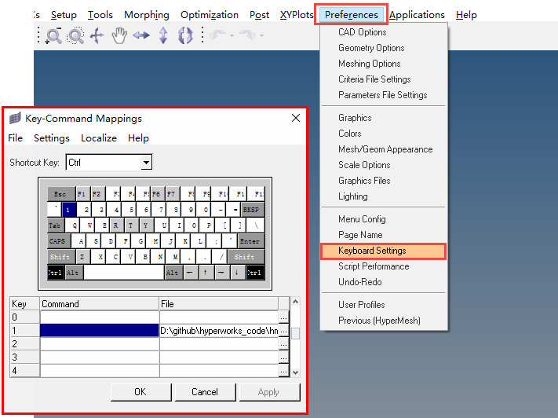

# TclPyHyperWorks
+ FEA
+ hyperworks Module, hypermesh

### version
+ hyperworks 13.0 / 2017 /2021.1
+ python 3.7
+ tcl

### Module
+ hm : hypermesh secondary development
+ hv : hyperview secondary development
+ hg2d: hypergraph 2d secondary development

+ Project_opt_fatigue: secondary development
+ Project_feon_learning
+ Project_Platform_ARB: 
+ Project_StrainPoint: 
+ Project_OptAutoRun: Optistruct .fem auto run

+ tests 

### Files
+ py_cmf_read : hypermesh command manual
+ py_cmf_read_2021 : hypermesh command manual 2021
+ py_file_del : 
+ py_zip : for backup
+ codes_hm_example : tcl code
+ codes_hmSources : tcl code
+ codes_tcl : 
+ ing_py_funForTCLtest : tcl call python for test
+ ing_py_hmBatRun : external call hmbatch.exe

### Examples

Shortcut settings

